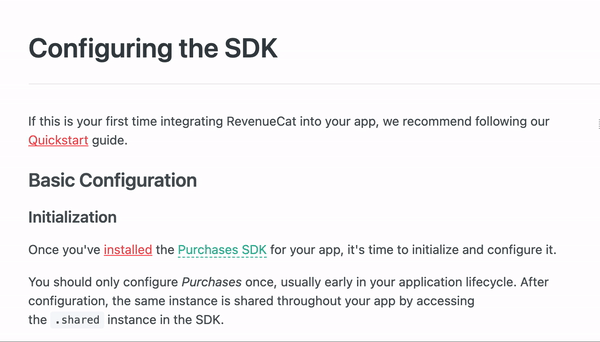

# 
  Creating Structured Content 

When writing technical documentation, there are cases where a table, photo, or other structure is the best way to display data. This guide will go over our best practices for creating additional structured content for a page.

## Tables   
We use tables and lists to show complex data in a more accessible, readable format. When deciding if a table or a list is the right option, reference the table below:

| Tables can be used for  |      Example      |  
|:------------|:-----------------|
|Data or values | A set of parameters in setting up a RevenueCat product | 
|Categories of items with examples| Use case scenarios for when to use restore behavior |
|Collections of items with at least two attributes| The events Amplitude tracks|
 
 ## Lists 
 We use lists when each item we are trying to represent is a single unit. The most often used instance of this is a list of steps for a developer to follow.
 
 ### Bulleted lists 
 Use a bulleted list when your information has elements in common but with no need for a particular order. 
 
 ### Numbered lists
 Numbered lists are for when your information must be in sequential order.
 
 #### Punctuation ( Numbered lists)
 Numbered lists should always follow the number with a period.
 
<pre>
❌  1 - Navigate to your app settings in the RevenueCat dashboard.
</pre>
<pre>
✅ 1. Navigate to your app settings in the RevenueCat dashboard.
</pre>
 
 ### Capitalization
 Always start each list item with a capital letter and follow with [sentence casing](https://github.com/JazmineMT/ContentGuide/blob/main/03-grammar-and-mechanics.md#other-content---sentence-case).

 
 
 
  
## Glossary
Throughout our documentation, we often reference products or tools that are unique to RevenueCat. A glossary makes sure our reader always understands our references. It’s best to add the glossary term so the reader can understand unique terms without looking back on addtional documentation. You can review the [ReadMe glossary term guide](https://blog.readme.com/glossary/) for how to add this to our documentation. 

## Photos
Photos are sometimes needed to display information. We often use photos in our product installation guides to show different dashboards and other relevant information. 

When using a photo, make sure it only includes relevant information. If you're pointing to specific items on the page, make sure to mark up the image to reflect this. We use red circle identifiers when marking photos.

Here's an example of a photo marked up for documentation:

## When to Combine Photos and Tables
Oftentimes we are sharing photos that contain a lot of information. This can be hard for the reader to follow. When sharing a photo that has more than 1 action item to follow, pair it with a table to address the multiple points of data. Make sure your table includes a key for the reader to follow along that corresponds with the photo. 
 
Here's an example of a photo paired with a table:

 
Don’t forget to create Alt text that describes the photo, allowing access to screen reading technologies.

## Callouts
Some content is so crucial that we need to separate it from the rest of the document. We use flavored callouts to display this. 

### Success
The success callout is best for letting the reader know a task is complete, a small reminder before continuing, or a helpful tip. 

> 👍  
> 
> This section assumes you've followed our Quickstart section of our Getting Started guide to install and configure our SDK.

### Info 
The info callout is for giving additional relevant information. This callout shouldn't contain information that must be completed before moving forward. It should contain links to external documentation or some information that the reader can continue to look into. 

>📘  Supported proration modes
>
> RevenueCat currently only supports `IMMEDIATE_WITH_TIME_PRORATION`. This mode changes the subscription immediately and the remaining time will be prorated.

### Warning 
The warning callout is best used to alert the reader to proceed with caution or to warn of a common mistake we see. It should be titled with **Warning** or **Important**. 

> 🚧  Warning
> 
> Only Package Pricing and Standard Pricing subscription plans with per unit pricing are supported. Metered usage and tiers are currently not supported.
  
### Error
The error callout is best used sparingly and for content that cannot be undone once an action is taken.

>❗  Careful
> 
> Deleting a user with live purchases may have downstream effects on charts and reporting.

## Next Steps 
At the end of a document, include Next Steps when relevant. Acceptable items to include here can be a related document you want the reader to visit or a blog post with similar helpful information. 

Here's an example of Next Steps included in our documentation:

